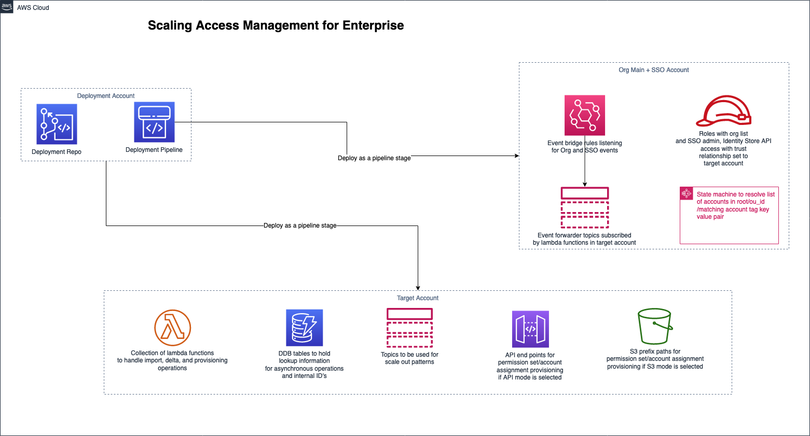

# AWS SSO Extensions For Enterprise

## Table of Contents

- [Overview](#Overview)
- [How to Deploy](https://catalog.workshops.aws/ssoextensions/en-US)
- [Features](#Features)

  - [The Composite Permission Set API](#the-composite-permission-set-api)
  - [Enterprise friendly account assignment life cycle](#enterprise-friendly-account-assignment-life-cycle)
  - [Automated access change management for root, ou_id and account_tag scopes](#automated-access-change-management-for-root-ou_id-and-account_tag-scopes)
  - [Import existing AWS SSO access entitlements for management through the solution](#import-existing-aws-sso-access-entitlements-for-management-through-the-solution)
  - [De-couple life cycle management of different SSO objects and other features](#de-couple-life-cycle-management-of-different-sso-objects-and-other-features)

- [Detailed Building Blocks Overview](docs/documentation/Building-Blocks.md)
- [Use case Flows](docs/documentation/Use-Case-Flows.md)
- [Schema Details for account assignment and permission set operations](#schema-details-for-account-assignment-and-permission-set-operations)
- [Using API interface for your use cases](#using-api-interface-for-your-use-cases)
- [Using S3 interface for your use cases](#using-s3-interface-for-your-use-cases)
- [Unicorn Rides use cases](https://catalog.workshops.aws/ssoextensions/en-US/03-usecases)
- [Nightly Run](#using-nightly-run-and-remediation-feature)
- [AWS SSO Region Switch](docs/documentation//Region-Switch.md)
- [Troubleshooting](docs/documentation/TroubleShooting.md)
- [Security](#security)
- [License](#license)

## Overview



**AWS SSO Extensions for Enterprise** simplifies the process to manage user
access to AWS accounts with [AWS SSO](https://aws.amazon.com/single-sign-on/) by extending the [AWS SSO API](https://docs.aws.amazon.com/singlesignon/latest/APIReference/welcome.html).

Instead of separately managing [AWS SSO permission sets](https://docs.aws.amazon.com/singlesignon/latest/userguide/permissionsetsconcept.html) and account
assignments, you can use this solution to describe permission sets with one API call
per set. Like with permission sets, you can also define and
implement account assignments at a global level, an organizational unit level or an account tag
level. The solution ensures your defined permissions are rolled out across
the entire AWS Organization, and that they are updated as you change your
organization.

This solution can be used by your identity and access management team to simplify user
access provisioning at scale, either via a RESTFul API or by defining and
setting objects with your permissions descriptions in an S3 bucket. This
enables you to integrate with upstream identity management systems you
have in your organization.

**[Get started with the deployment!](https://catalog.workshops.aws/ssoextensions/en-US)**

## Features

### The Composite Permission Set API

This solution provides a composite API for managing permission set lifecycles, allowing you to:

- Create a permission set object including attributes and policies in a single call
- Update parts or all of a permission set object in a single call with a friendly name
- Delete a complete permission set in a single call with a friendly name
- Based on a configuration parameter, use either an S3 based interface or a RESTful API to upload permission set object as a whole
- Enforce the "cannot delete" constraint when a permission set is being referenced in an account assignment

<details>
<summary>Example payload to <b>create a permission set</b></summary>
<p>

```json
{
  "action": "create",
  "permissionSetData": {
    "permissionSetName": "CloudOperator-ps",
    "sessionDurationInMinutes": "240",
    "relayState": "https://{{region}}.console.aws.amazon.com/console/home?region={{region}}#",
    "tags": [
      {
        "Key": "versionid",
        "Value": "01"
      },
      {
        "Key": "team",
        "Value": "CloudOperators"
      }
    ],
    "managedPoliciesArnList": [
      "arn:aws:iam::aws:policy/job-function/SystemAdministrator",
      "arn:aws:iam::aws:policy/job-function/NetworkAdministrator"
    ],
    "inlinePolicyDocument": {
      "Version": "2012-10-17",
      "Statement": [
        {
          "Action": [
            "iam:AddRoleToInstanceProfile",
            "iam:CreateInstanceProfile",
            "iam:CreatePolicy",
            "iam:CreatePolicyVersion",
            "iam:DeleteInstanceProfile",
            "iam:DeletePolicy",
            "iam:DeleteRole",
            "iam:PassRole",
            "iam:UpdateRole",
            "iam:DeleteRolePermissionsBoundary",
            "iam:UpdateRoleDescription",
            "iam:RemoveRoleFromInstanceProfile"
          ],
          "Resource": [
            "arn:aws:iam::*:role/Application_*",
            "arn:aws:iam::*:policy/Application_*",
            "arn:aws:iam::*:instance-profile/Application_*"
          ],
          "Effect": "Allow",
          "Sid": "AllowOtherIAMActions"
        },
        {
          "Action": ["iam:List*", "iam:Generate*", "iam:Get*", "iam:Simulate*"],
          "Resource": "*",
          "Effect": "Allow",
          "Sid": "AllowReadIAMActions"
        }
      ]
    }
  }
}
```

</p>
</details>

<details>
<summary>Example payload to <b>update a permission set</b></summary>
<p>

```json
{
  "action": "update",
  "permissionSetData": {
    "permissionSetName": "CloudOperator-ps",
    "sessionDurationInMinutes": "420",
    "relayState": "https://{{region}}.console.aws.amazon.com/console/home?region={{region}}#",
    "tags": [
      {
        "Key": "versionid",
        "Value": "02"
      },
      {
        "Key": "team",
        "Value": "CloudOperators"
      }
    ],
    "managedPoliciesArnList": [
      "arn:aws:iam::aws:policy/job-function/SystemAdministrator",
      "arn:aws:iam::aws:policy/job-function/NetworkAdministrator",
      "arn:aws:iam::aws:policy/AWSHealthFullAccess"
    ],
    "inlinePolicyDocument": {
      "Version": "2012-10-17",
      "Statement": [
        {
          "Action": ["iam:List*", "iam:Generate*", "iam:Get*", "iam:Simulate*"],
          "Resource": "*",
          "Effect": "Allow",
          "Sid": "AllowReadIAMActions"
        }
      ]
    }
  }
}
```

</p>
</details>

<details>
<summary>Example payload to <b>delete a permission set</b></summary>
<p>

```json
{
  "action": "delete",
  "permissionSetData": {
    "permissionSetName": "CloudOperator-ps"
  }
}
```

</p>
</details>

### Enterprise friendly account assignment life cycle

This solution enables enterprise friendly account assignment lifecycles through the following features:

- Using users/groups as the mechanism for the principal type
- Friendly names for users/groups and permission sets when creating account assignments
- Based on the configuration parameter, you can use either an S3 based interface/ Rest API interface to create/delete account assignments
- Create & delete account assignments with scope set to **account, root, ou_id or account_tag**
- Using the entity value passed in the payload, the solution calculates the account list and processes the account assignment operations on all the accounts automatically

<b>NOTE:</b> Permission sets and user/group assignments cannot be applied to the Organization Main account (also known as the Master Payer) due to a design constraint of the AWS API. There is no available mechanism to programmatically manage the permission sets and user/group assignments of the Organization Main account.

<details>
<summary>Example payload to provision permission set <b>CloudOperator-ps</b> for <b>all accounts in your organization</b> and provide access to <b>team-CloudOperators user group</b></summary>
<p>

```json
{
  "action": "create",
  "linkData": "root%all%CloudOperator-ps%team-CloudOperators%GROUP%ssofile"
}
```

</p>
</details>

<details>
<summary>Example payload to provision permission set <b>SecurityAuditor-ps</b> for <b>all accounts in your organization unit with ID ou-id12345</b> and provide access to <b>team-SecurityAuditors user group</b></summary>
<p>

```json
{
  "action": "create",
  "linkData": "ou_id%ou-id12345%SecurityAuditor-ps%team-SecurityAuditors%GROUP%ssofile"
}
```

</p>
</details>

<details>
<summary>Example payload to provision permission set <b>DataScientist-ps</b> for <b>all accounts that have tagkey team set to value DataScientists</b> and provide access to <b>team-DataScientists user group</b></summary>
<p>

```json
{
  "action": "create",
  "linkData": "account_tag%team^DataScientists%DataScientist-ps%team-DataScientists%GROUP%ssofile"
}
```

</p>
</details>

<details>
<summary>Example payload to provision permission set <b>Billing-ps</b> for <b>account 123456789012</b> and provide access to <b>team-Accountants user group</b></summary>
<p>

```json
{
  "action": "create",
  "linkData": "account%123456789012%Billing-ps%team-Accountants%GROUP%ssofile"
}
```

</p>
</details>

<details>
<summary>Example payload to provision permission set <b>Breakglass-ps</b> for <b>all accounts in your organization</b> and provide access to <b>break-glass user</b></summary>
<p>

```json
{
  "action": "create",
  "linkData": "root%all%Breakglass-ps%break-glass%USER%ssofile"
}
```

</p>
</details>
<br/>

### Automated access change management for root, ou_id and account_tag scopes

The solution provides automated change access management through the following features:

- If an account assignment has been created through the solution with scope set to root, and if a new account has been created at a later time, this new account is automatically provisioned with the account assignment.
- If an account assignment has been created through the solution with scope set to ou_id, and an existing account moves out of this ou, this account assignment is automatically deleted from the account by the solution. If a new account is moved in to the ou, this account assignment is automatically created for the account by the solution.
- If an account assignment has been created through the solution with scope set to account_tag, and an account is updated with this tag key value at a later time, this account assignment is automatically created for the new account by the solution. Additionally, when this tag key value is removed from the account/when this tag key is updated to a different value on the account at a later time, this account assignment is automatically deleted from the account by the solution.

### Import existing AWS SSO access entitlements for management through the solution

- The solution enables importing existing AWS SSO access entitlements for management through the solution
- Based on the `ImportCurrentSSOConfiguration` flag in the configuration file, the solution would import all existing permission sets and account assignments so that they could be updated/deleted through the solution interfaces
- The solution ensures that all related attributes of permission sets/account assignments are imported in a format that would allow you to manage them through the solution interfaces
- All account assignments would be imported as `account` scope types

### De-couple life cycle management of different SSO objects and other features

- The solution enables de-coupling creation of permission sets , user groups and account assignment operations completely. They could be created in any sequence, thereby enabling enterprise teams to handle these objects lifecycles through different workflow process that align to their needs, and the solution would handle the target state appropriately
- The solution enables usage of friendly names in managing permission set, account assignment life cycles and would handle the translation of friendly names into internal AWS SSO GUID's automatically
- The solution enables deployment in a distributed model i.e. orgmain, deployment and target account (or) in a single account model i.e. orgmain only. It's recommended that single account model of deployment be used only for demonstration purposes
- The solution assumes that AWS SSO is enabled in a different account other than orgmain account and has the required cross-account permissions setup to enable the functionalities. This future-proofs the solution to support the scenario when AWS SSO service releases delegated admin support similar to other services such as GuardDuty

## Schema details for account assignment and permission set operations

- For account assignment operations with API interface
  - _action_ should be exactly one of **create, delete**
  - _linkData_ should match this format: `scopetype%scopevalue%permissionsetname%principalname%principaltype%ssofile`
- For account assignment operations with S3 interface
  - file name should match this format: `scopetype%scopevalue%permissionsetname%principalname%principaltype%ssofile`
  - file contents are empty i.e. empty file
- For both interface types,
  - `scopetype` should be exactly one of **root, ou_id, account_tag, account**
  - `scopevalue` sould match the keyword `all` if scopetype is set to root
  - `scopevalue` should match the organisational unit ID if scopetype is set to ou_id
  - `scopevalue` should match `tagkey^tagvalue` convention if scopetype is set to account_tag
  - `scopevalue` should have account number if scopetype is set to account
  - `permissionsetname` should match permission set name
  - `principalname` should match `displayname` if principal type is group , else it should match `username` if principal type is user
  - `principaltype` should be exactly one of **GROUP, USER**
- For permission set operations with API interface
  - _action_ should be exactly one of **create, update, delete**
- For permission set operations with S3 interface
  - file name should match this format: `permisssionsetname.json`

## Using API interface for your use cases

If you chose to use `API` interface for managing your permission sets and account assignments i.e. set `LinksProvisioningMode` or `PermissionSetProvisioningMode` to `api`, then read below for usage instructions:

- Refer to postman collection sample under `docs\samples\postman-collection` for account assignment and permission set operation examples
- More details on using `API` interface are documented [here](https://catalog.workshops.aws/ssoextensions/en-US/02-api)

## Using S3 interface for your use cases

If you chose to use `S3` interface for managing your permission sets and account assignments i.e. set `LinksProvisioningMode` or `PermissionSetProvisioningMode` to `s3`, then read below for usage instructions:

- Refer to sample files under `docs\samples\links_data` for account assignment operations and `docs\samples\permission_sets` for permission set operations
- After deploying the solution with S3 interface, navigate to `target` account and under `env-aws-sso-extensions-for-enterprise-preSolutionArtefactsStack` outputs , you will have the S3 locations for uploading your permission sets and account assignments
- For account assignment operations, uploading a file to the S3 prefix path would map to creating an account assignment and deleting a file from the S3 prefix path would map to deleting an account assignment
- For permission set operations, uploading a new file to the S3 prefix path would map to creating a permission set, uploading a new copy of the file would map to updating the permission set, and deleting the file would map to deleting the permission set

- Ensure your deployment account has a cloudtrail. If not, the solution will not be able to provision permission sets when moving in and out of OUs as these events will not register with the event bus.

## Using nightly run and remediation feature

If you chose to enable the nightly run feature, i.e. set `EnableNightlyRun` to `true`, then read below for information and usage instructions:

- The nightly run feature will run daily at 23:00. This will determine any deviations between permission set/account assignments within AWS SSO configuration and those found in the solution (Dynamo DB tables).
- The deviations are in two categories: 1) Unknown account assignments/permission sets. This is where a change has been made outside of the solution to create a new permission set/assignment and is therefore unknown to the solution. 2) Changed permission sets (i.e. changes to attached policies, session duration tags)
- Any deviations found will either be auto remediated or a user will be notified.

- Set `NightlyRunRemediationMode` to `AUTOREMEDIATE` to delete unknown (additional) account assignments/permissions sets, and to update changed permission sets.
- Set `NightlyRunRemediationMode` to `NOTIFY` to be notified about any unknown account assignments/permissions sets, and changed permission sets. Notifications will be sent to the email that is subscribed to the SNS topic, i.e. the email set in `NotificationEmail`.

- _Note: This feature currently looks at changes/new entities being present. This does not yet determine if account assignments/permission sets are missing._

## Security

See [CONTRIBUTING](CONTRIBUTING.md) for more information.

## License

This library is licensed under the MIT-0 License. See the LICENSE file.
