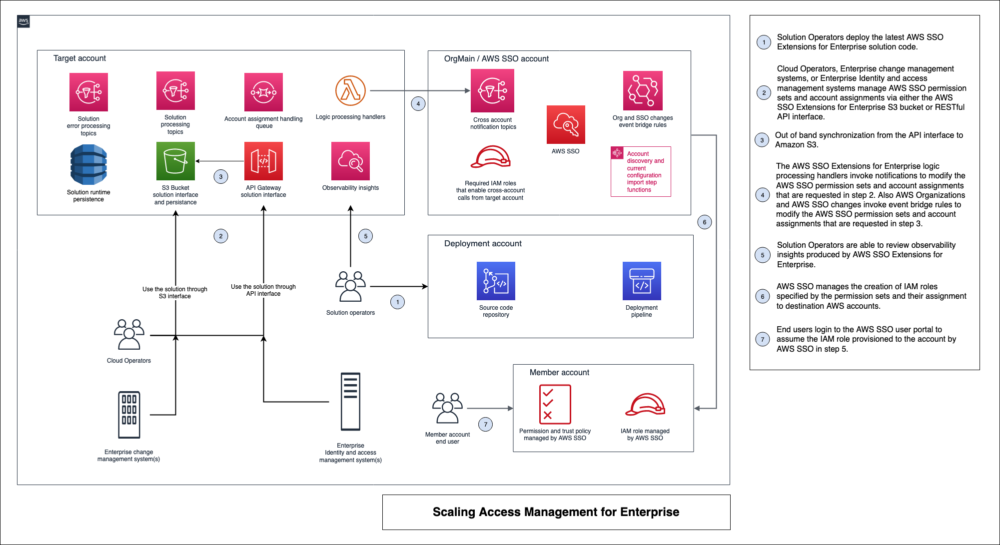

# AWS SSO Extensions For Enterprise

## Overview

`AWS SSO Extensions for Enterprise` simplifies the process to manage user
access to AWS accounts with [AWS SSO](https://aws.amazon.com/single-sign-on/) by extending the [AWS SSO API](https://docs.aws.amazon.com/singlesignon/latest/APIReference/welcome.html).  

Instead of separately managing [AWS SSO permission sets](https://docs.aws.amazon.com/singlesignon/latest/userguide/permissionsetsconcept.html) and entitlement
links, you can use this solution to describe permission sets with one API call
per set. Like with permission sets, you can also define and
implement entitlement links at a global level, an organizational unit level or an account tag
level. The solution ensures your defined permissions are rolled out across
the entire AWS Organization, and that they are updated as you change your
organization.  

This solution can be used by your IAM management team to simplify user
access provisioning at scale, either via a RESTFul API or by defining and
setting objects with your permissions descriptions in an S3 bucket. This
enables you to integrate with upstream identity management systems you
have in your organization.  

**[Get started deploying here!](docs/documentation/How-To-Deploy.md)**

## Features

### The Composite Permission Set API

The current Permission Set API  is a set of individual API's which each tackle one element of the permission set. For example, the CreatePermissionSet action allows you to create Permission sets with multiple attributes, such as its name and its tag.

This can require additional API calls to attach/remove [Managed IAM policies](https://docs.aws.amazon.com/IAM/latest/UserGuide/access_policies_managed-vs-inline.html) and create/update/delete inline policies attached to the permission set.
When we want to handle permission set lifecycles at scale, this becomes challenging.

_How is this problem solved?_

This solution provides a composite API for managing permission set lifecycles, allowing you to:

- Create a complete permission set object including attributes and policies in a single call
- Update parts or all of a permission set object in a single call with a friendly name
- Delete a complete permission set in a single call with a friendly name
- Based on a configuration parameter, use either an S3 based interface or a RESTful API to upload permission set object as a whole
- Enforce the "cannot delete" constraint when a permission set is being referenced in an entitlement

### Enterprise friendly account assignment life cycle

The current entitlement API calls (createAccountAssignment, deleteAccountAssignment) use SSO generated ARNs for referencing the principalId, instanceArn and permissionSetArn.

The current entitlement API's are only account-level and do not handle organization based entitlement provisioning and de-provisioning. This means at the moment, enterprises need to build their own automation for their SSO provisioning use cases.

_How is the problem solved?_

This solution enables enterprise friendly account assignment lifecycles through the following features:

- Using groups as the mechanism for the principal type, instead of an individual user
- Friendly names for groups and permission sets when creating account assignments
- Based on the configuration parameter, use either an S3 based interface/ Rest API interface to create/delete account assignments
- Create & delete account assignments with scope set to account, root, ou_id or account_tag at the organizational level
- Using the entity value passed in the payload, the solution calculates the account list and processes the update operations for you
- Enable out of band integration between group life cycles and account assignment life cycles:
  - The solution listens on AWS SSO group creation/deletion events (from any source - SCIM/Console/CLI etc) and handles out of band integration use cases with account assignments and permission sets
  - The solution facilitates operations of user groups, account assignments and permission sets in any order you choose.
  - The solution translates the group name to GUID translation on your behalf, enabling you to specify your account assignment operations using friendly names

The solution also deploys in us-east-1 to handle future organizational changes.

_Use Cases_

- If an account assignment has been created through the solution with scope set to root, and if a new account has been created at a later time, this account assignment is automatically created for the new account by the solution.
- If an account assignment has been created through the solution with scope set to ou_id, and an existing account moves out of this ou, this account assignment is automatically deleted from the account by the solution. If a new account is moved in to the ou, this account assignment is automatically created for the account by the solution.
- If an account assignment has been created through the solution with scope set to account_tag, and an account is updated with this tag key value at a later time, this account assignment is automatically created for the new account by the solution. Additionally, when this tag key value is removed from the account/when this tag key is updated to a different value on the account at a later time, this account assignment is automatically deleted from the account by the solution.

## [How to Deploy](docs/documentation/How-To-Deploy.md)

## [Start Using [LINK TO WORKSHOP WHEN LIVE]](/)

## [Use case Logical State Flows](docs/documentation/Use-Case-Logical-State-Flows.md)

## [Building blocks](docs/documentation/Building-Blocks.md)

## [Solution block diagrams](docs/documentation/Overview-diagrams.md)

## [Enterprise IAM Integration](docs/documentation/Enterprise-IAM-Integration.md)
