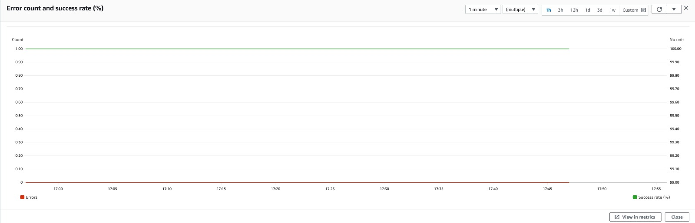

# Scaling the solution for large enterprises

- The solution is designed to scale for any organization size while ensuring that it works without being throttled against the [default AWS SSO Admin API quota](https://docs.aws.amazon.com/singlesignon/latest/userguide/limits.html)

- The solution has been tested with the following load parameters:

  - For an AWS organizational unit with **60 accounts, 5 account assignments at the OU scope were created and deleted concurrently (within one minute)**.
  - This resulted in **1200 account assignment operations (600 create, 600 delete)** being posted to the AWS SSO instance.
  - The solution processed all the **1200 account assignment operations in 61 minutes with 100% success rate**.

## Account assignment processing metrics

## Tuning the solution for larger environments

- The solution has a configurable visibility timeout parameter for the messages in the account assignment queue. This is defined in **hours** as part of your environment configuration file.
- The solution sets this to a default value of 2 hours.
- This timeout has been tested to work up to 1200 **concurrent** account assignment operations with the worst case scenario of a 100% redrive in the message queue.
- If your target concurrent account assignment operations is higher than 1200, the timeout value should be linearly scaled. For ex, if you are targeting 3600 **concurrent** assignment operations , then the timeout value should be set to 6 hours to cater for the worst case scenario of 100% redrive in the message queue.
