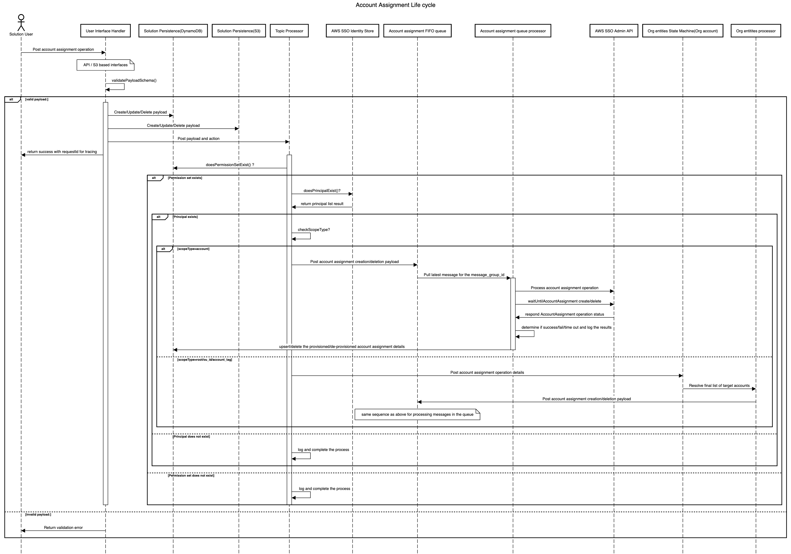
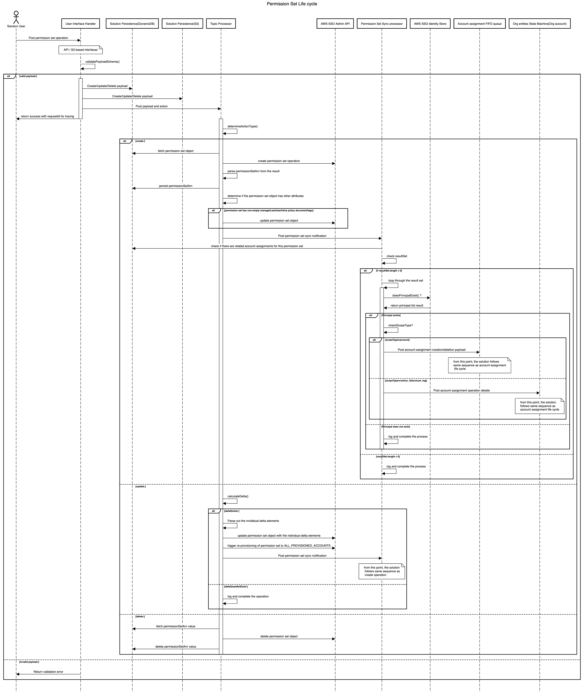
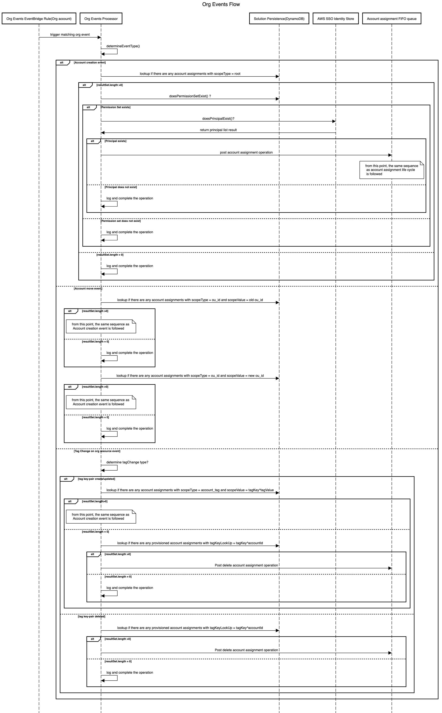
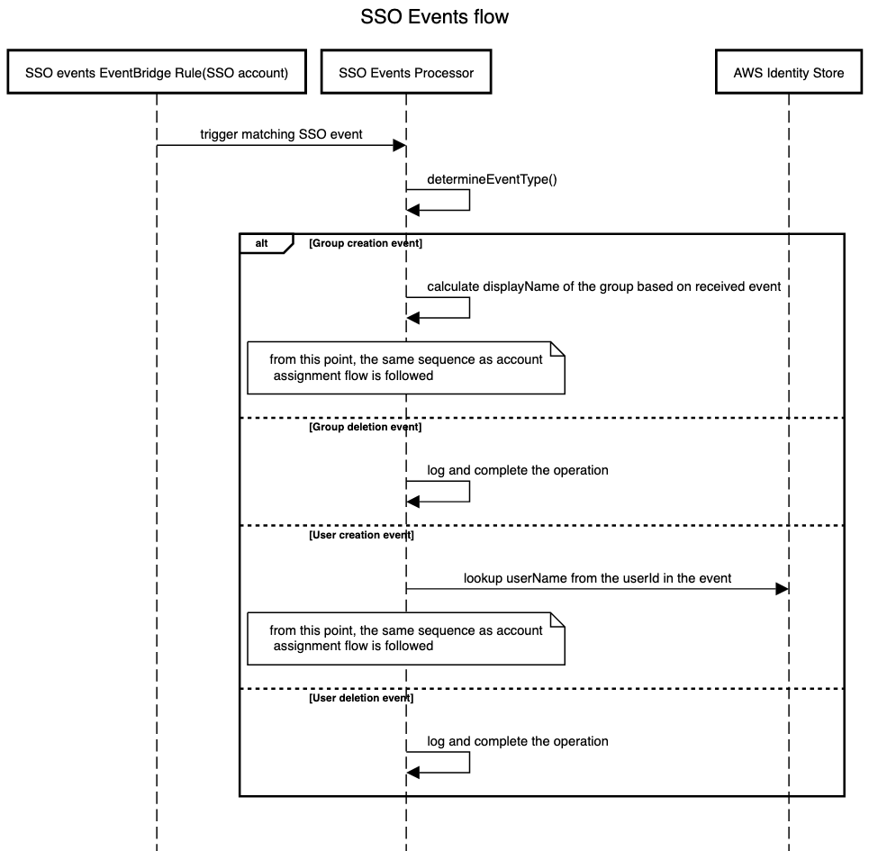
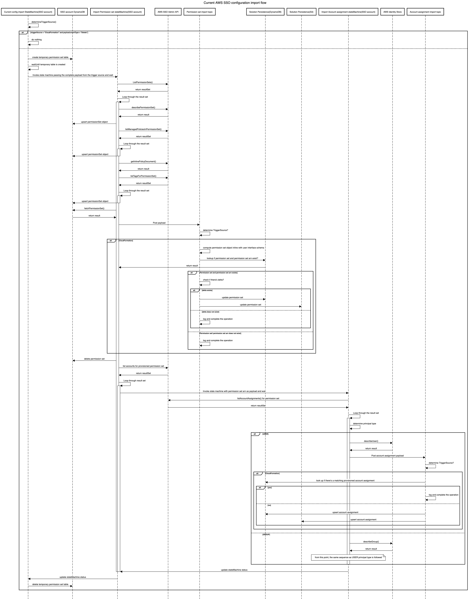

# Use Case Logical State Diagrams

For more information on going through the use cases for this solution, see the workshop [here](https://catalog.workshops.aws/ssoextensions/en-US/03-usecases)

## Account Assignment Life Cycle

## Permission Set Life Cycle

## Org Events Flow

## SSO Events Flow

## Current AWS IAM Identity Center Configuration Import flow

