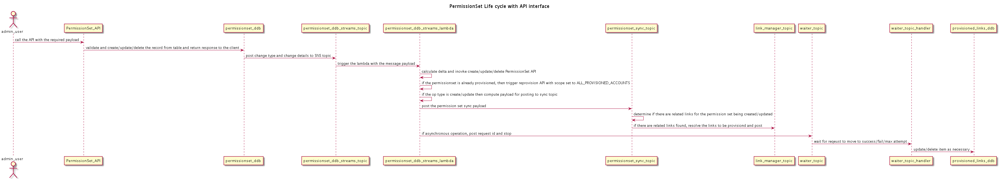
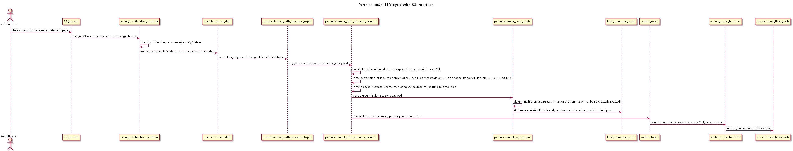
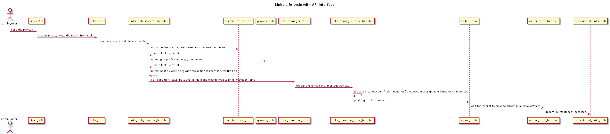
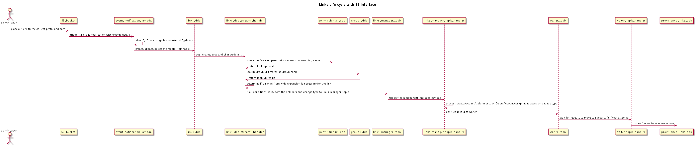
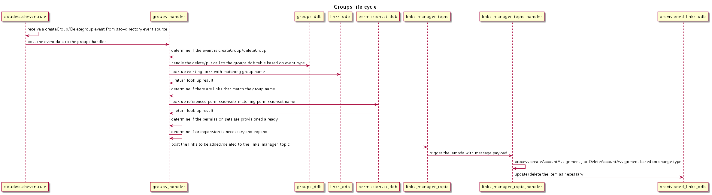
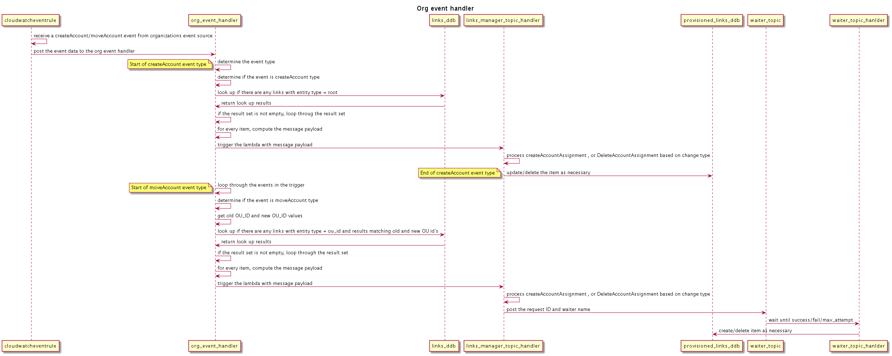

# Use Case logical state diagrams
## 1. Permission Set Life Cycle

### Permission Set with API Interface

### Permission Set with S3 Interface

## 2. Links life cycle

### Links with API Interface

### Links with S3 Interface

## 3. Groups Life Cycle

## 4. Organization Events Life Cycle

